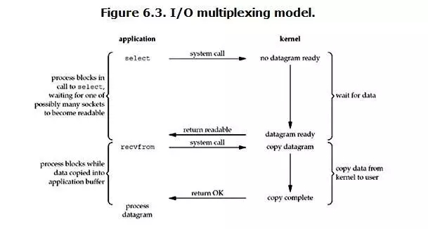

# [Redis高并发和快速的原因](https://www.cnblogs.com/angelyan/p/10450885.html)

**阅读目录**

- 一.Redis的高并发和快速原因
- 二.为什么Redis是单线程的
- 三.Redis单线程的优劣势
- 四.Redis高并发快总结

 

## 一、Redis的高并发和快速原因

1.redis是基于内存的，内存的读写速度非常快；

2.redis是单线程的，省去了很多上下文切换线程的时间，单线程操作不需要考虑锁和同步执行效率更高；

3.redis使用多路复用技术，可以处理并发的连接。非阻塞IO内部实现采用epoll，采用了epoll+自己实现的简单的事件框架（改写自libevent）。epoll中的读、写、关闭、连接都转化成了事件，然后利用epoll的多路复用特性，目的是绝不在io上浪费一点时间。

4.数据结构简单，对数据操作也简单，Redis中的数据结构是专门进行设计的。

5.**使用特殊的内存模型，Redis直接自己构建了VirtualMemorey 机制 ，可以将不常用的vlaue交换到磁盘，达到冷热数据分离的目的，同时也能缓解内存不足的问题，因为一般的系统调用系统函数的话，会浪费一定的时间去移动和请求**。（vm特性有很多问题，已过期，官方不建议使用）

## 二、为什么Redis是单线程的

**1.官方答案**

因为Redis是基于内存的操作，CPU不是Redis的瓶颈，Redis的瓶颈最有可能是机器**内存的大小**或者**网络带宽**。既然单线程容易实现，而且CPU不会成为瓶颈，那就顺理成章地采用单线程的方案了。

**2.性能指标**

关于redis的性能，官方网站也有，普通笔记本轻松处理每秒几十万的请求。

**3.详细原因**

**1）不需要各种锁的性能消耗**

Redis的数据结构并不全是简单的Key-Value，还有list，hash等复杂的结构，这些结构有可能会进行很细粒度的操作，比如在很长的列表后面添加一个元素，在hash当中添加或者删除

一个对象。这些操作可能就需要加非常多的锁，导致的结果是同步开销大大增加。

总之，在单线程的情况下，就不用去考虑各种锁的问题，不存在加锁释放锁操作，没有因为可能出现死锁而导致的性能消耗。

**2）单线程多进程集群方案**

单线程的威力实际上非常强大，每核心效率也非常高，多线程自然是可以比单线程有更高的性能上限，但是在今天的计算环境中，即使是单机多线程的上限也往往不能满足需要了，需要进一步摸索的是多服务器集群化的方案，这些方案中多线程的技术照样是用不上的。**所以单线程+多进程的集群不失为一个时髦的解决方案。**

**3）CPU消耗**

采用单线程，避免了不必要的上下文切换和竞争条件，也不存在多进程或者多线程导致的切换而消耗 CPU。但是如果CPU成为Redis瓶颈，或者不想让服务器其他CUP核闲置，那怎么办？可以考虑多起几个Redis进程，Redis是key-value数据库，不是关系数据库，数据之间没有约束。只要客户端分清哪些key放在哪个Redis进程上就可以了。

## 三、Redis单线程的优劣势

**1.单进程单线程优势**

1. 代码更清晰，处理逻辑更简单
2. 不用去考虑各种锁的问题，不存在加锁释放锁操作，没有因为可能出现死锁而导致的性能消耗
3. 不存在多进程或者多线程导致的切换而消耗CPU

**2.单进程单线程弊端**

1. 无法发挥多核CPU性能，不过可以通过在单机开多个Redis实例来补足

**3.IO多路复用技术**

redis 采用网络IO多路复用技术来保证在多连接的时候， 系统的高吞吐量。

多路-指的是多个socket连接，复用-指的是复用一个线程。多路复用主要有三种技术：select，poll，epoll。epoll是最新的也是目前最好的多路复用技术。

这里“多路”指的是多个网络连接，“复用”指的是复用同一个线程。采用多路 I/O 复用技术可以让单个线程高效的处理多个连接请求（尽量减少网络IO的时间消耗），且Redis在内存中操作数据的速度非常快（内存内的操作不会成为这里的性能瓶颈），主要以上两点造就了Redis具有很高的吞吐量。

## 四、Redis高并发快总结

1. Redis是纯内存数据库，一般都是简单的存取操作，线程占用的时间很多，时间的花费主要集中在IO上，所以读取速度快。

2. 再说一下IO，Redis使用的是非阻塞IO，IO多路复用，使用了单线程来轮询描述符，将数据库的开、关、读、写都转换成了事件，减少了线程切换时上下文的切换和竞争。

3. Redis采用了单线程的模型，保证了每个操作的原子性，也减少了线程的上下文切换和数据竞争。

4. 另外，数据结构也帮了不少忙，Redis全程使用hash结构，读取速度快，还有一些特殊的数据结构，对数据存储进行了优化，如压缩表，对短数据进行压缩存储，再如，跳表，使用有序的数据结构加快读取的速度。

5. 还有一点，Redis采用自己实现的事件分离器，效率比较高，内部采用非阻塞的执行方式，吞吐能力比较大。