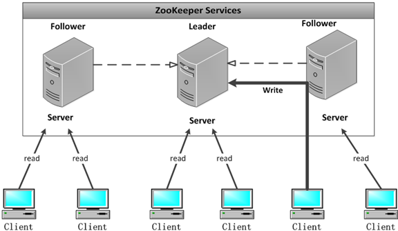
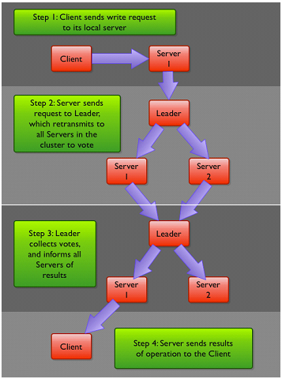
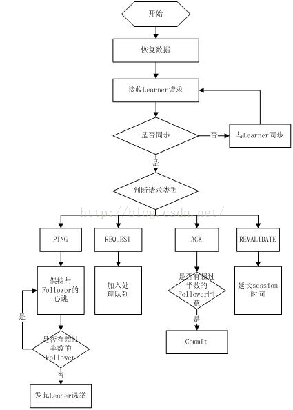
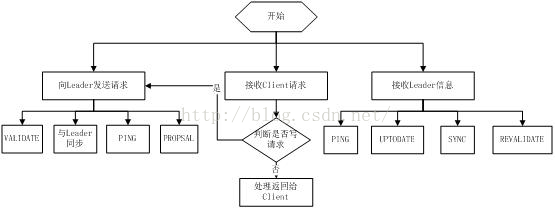

# [Zookeeper到底是干嘛的](https://www.cnblogs.com/ultranms/p/9585191.html)

在Zookeeper的官网上有这么一句话：ZooKeeper is a centralized service for maintaining configuration information, naming, providing distributed synchronization, and providing group services. 

这大概描述了Zookeeper主要可以干哪些事情：配置管理，名字服务，提供分布式同步以及集群管理。那这些服务又到底是什么呢？我们为什么需要这样的服务？我们又为什么要使用Zookeeper来实现呢，使用Zookeeper有什么优势？接下来我会挨个介绍这些到底是什么，以及有哪些开源系统中使用了。

### 配置管理

在我们的应用中除了代码外，还有一些就是各种配置。比如数据库连接等。一般我们都是使用配置文件的方式，在代码中引入这些配置文件。但是当我们只有一种配置，只有一台服务器，并且不经常修改的时候，使用配置文件是一个很好的做法，但是如果我们配置非常多，有很多服务器都需要这个配置，而且还可能是动态的话使用配置文件就不是个好主意了。这个时候往往需要寻找一种集中管理配置的方法，我们在这个集中的地方修改了配置，所有对这个配置感兴趣的都可以获得变更。比如我们可以把配置放在数据库里，然后所有需要配置的服务都去这个数据库读取配置。但是，因为很多服务的正常运行都非常依赖这个配置，所以需要这个集中提供配置服务的服务具备很高的可靠性。一般我们可以用一个集群来提供这个配置服务，但是用集群提升可靠性，那如何保证配置在集群中的一致性呢？ 这个时候就需要使用一种实现了一致性协议的服务了。Zookeeper就是这种服务，它使用Zab这种一致性协议来提供一致性。现在有很多开源项目使用Zookeeper来维护配置，比如在HBase中，客户端就是连接一个Zookeeper，获得必要的HBase集群的配置信息，然后才可以进一步操作。还有在开源的消息队列Kafka中，也使用Zookeeper来维护broker的信息。在Alibaba开源的SOA框架Dubbo中也广泛的使用Zookeeper管理一些配置来实现服务治理。

### 名字服务

名字服务这个就很好理解了。比如为了通过网络访问一个系统，我们得知道对方的IP地址，但是IP地址对人非常不友好，这个时候我们就需要使用域名来访问。但是计算机是不能是别域名的。怎么办呢？如果我们每台机器里都备有一份域名到IP地址的映射，这个倒是能解决一部分问题，但是如果域名对应的IP发生变化了又该怎么办呢？于是我们有了DNS这个东西。我们只需要访问一个大家熟知的(known)的点，它就会告诉你这个域名对应的IP是什么。在我们的应用中也会存在很多这类问题，特别是在我们的服务特别多的时候，如果我们在本地保存服务的地址的时候将非常不方便，但是如果我们只需要访问一个大家都熟知的访问点，这里提供统一的入口，那么维护起来将方便得多了。

### 分布式锁

其实在第一篇文章中已经介绍了Zookeeper是一个分布式协调服务。这样我们就可以利用Zookeeper来协调多个分布式进程之间的活动。比如在一个分布式环境中，为了提高可靠性，我们的集群的每台服务器上都部署着同样的服务。但是，一件事情如果集群中的每个服务器都进行的话，那相互之间就要协调，编程起来将非常复杂。而如果我们只让一个服务进行操作，那又存在单点。通常还有一种做法就是使用分布式锁，在某个时刻只让一个服务去干活，当这台服务出问题的时候锁释放，立即fail over到另外的服务。这在很多分布式系统中都是这么做，这种设计有一个更好听的名字叫Leader Election(leader选举)。比如HBase的Master就是采用这种机制。但要注意的是分布式锁跟同一个进程的锁还是有区别的，所以使用的时候要比同一个进程里的锁更谨慎的使用。

### 集群管理

在分布式的集群中，经常会由于各种原因，比如硬件故障，软件故障，网络问题，有些节点会进进出出。有新的节点加入进来，也有老的节点退出集群。这个时候，集群中其他机器需要感知到这种变化，然后根据这种变化做出对应的决策。比如我们是一个分布式存储系统，有一个中央控制节点负责存储的分配，当有新的存储进来的时候我们要根据现在集群目前的状态来分配存储节点。这个时候我们就需要动态感知到集群目前的状态。还有，比如一个分布式的SOA架构中，服务是一个集群提供的，当消费者访问某个服务时，就需要采用某种机制发现现在有哪些节点可以提供该服务(这也称之为服务发现，比如Alibaba开源的SOA框架Dubbo就采用了Zookeeper作为服务发现的底层机制)。还有开源的Kafka队列就采用了Zookeeper作为Cosnumer的上下线管理。

自己的一些理解：

Leader可以接受client请求，也接收其他Server转发的写请求，负责更新系统状态。 Follower也可以接收client请求，如果是写请求将转发给Leader来更新系统状态，读请求则由Follower的内存数据库直接响应。

​                      

 

 

事物操作 
在ZooKeeper中，能改变ZooKeeper服务器状态的操作称为事务操作。一般包括数据节点创建与删除、数据内容更新和客户端会话创建与失效等操作。对应每一个事务请求，ZooKeeper都会为其分配一个全局唯一的事务ID，用 ZXID 表示，通常是一个64位的数字。每一个 ZXID对应一次更新操作，从这些 ZXID 中可以间接地识别出 ZooKeeper 处理这些事务操作请求的
全局顺序。

Watcher(事件监听器)
ZooKeeper 中一个很重要的特性。ZooKeeper允许用户在指定节点上注册一些 Watcher，并且在一些特定事件触发的时候，ZooKeeper服务端会将事件通知到感兴趣的客户端上去。该机制是 ZooKeeper 实现分布式协调服务的重要特性。

ZooKeeper数据模型的结构整体上可以看作是一棵树，每个节点称做一个ZNode。每个ZNode都可以通过其路径唯一标识在每个ZNode上可存储少量数据(默认是1M, 可以通过配置修改, 通常不建议在ZNode上存储大量的数据)

ZooKeeper支持一种Watch操作，Client可以在某个ZNode上设置一个Watcher，来Watch该ZNode上的变化。如果该ZNode上有相应的变化，就会触发这个Watcher，把相应的事件通知给设置Watcher的Client。需要注意的是，ZooKeeper中的Watcher是一次性的，即触发一次就会被取消，如果想继续Watch的话，需要客户端重新设置Watcher

节点状态
每个集群中的节点都有一个状态 LOOKING, FOLLOWING, LEADING, OBSERVING。都属于这4种，每个节点启动的时候都是LOOKING状态，如果这个节点参与选举但最后不是leader，则状态是FOLLOWING，如果不参与选举则是OBSERVING，leader的状态是LEADING。

关于ZooKeeper集群服务器数
ZooKeeper 官方确实给出了关于奇数的建议，但绝大部分 ZooKeeper 用户对于这个建议认识有偏差。一个 ZooKeeper 集群如果要对外提供可用的服务，那么集群中必须要有过半的机器正常工作并且彼此之间能够正常通信。基于这个特性，如果想搭建一个能够允许 N 台机器 down 掉的集群，那么就要部署一个由 2*N+1 台服务器构成的 ZooKeeper 集群。因此，一个由 3 台机器构成的 ZooKeeper 集群，能够在挂掉 1 台机器后依然正常工作，而对于一个由 5 台服务器构成的 ZooKeeper 集群，能够对 2 台机器挂掉的情况进行容灾。注意，如果是一个由6台服务器构成的 ZooKeeper 集群，同样只能够挂掉 2 台机器，因为如果挂掉 3 台，剩下的机器就无法实现过半了。

zookeeper有这样一个特性：

【集群中只要有超过过半的机器是正常工作的，那么整个集群对外就是可用的】

 也就是说如果有2个zookeeper，那么只要有1个死了zookeeper就不能用了，因为1没有过半，所以2个zookeeper的死亡容忍度为0；

同理，要是有3个zookeeper，一个死了，还剩下2个正常的，过半了，所以3个zookeeper的容忍度为1；

同理你多列举几个：2->0;3->1;4->1;5->2;6->2会发现一个规律，2n和2n-1的容忍度是一样的，

都是n-1，所以为了更加高效，何必增加那一个不必要的zookeeper呢。

ZooKeeper可伸缩性 
那么，ZooKeeper为什么要引入Observer这个角色呢？其实在ZooKeeper中引入Observer，主要是为了使ZooKeeper具有更好的可伸缩性。那么，何为可伸缩性？关于伸缩性，对于不同的人意味着不同的事情。 而在这里是说，如果我们的工作负载可以通过给系统分配更多的资源来分担，那么这个系统就是可伸缩的；一个不可伸缩的系统却无法通过增加资源来提升性能，甚至会在工作负载增加时，性能会急剧下降。
在Observer出现以前，ZooKeeper的伸缩性由Follower来实现，我们可以通过添加Follower节点的数量来保证ZooKeeper服务的读性能。但是随着Follower节点数量的增加，ZooKeeper服务的写性能受到了影响。

简单来说，Zab协议规定：来自Client的所有写请求，都要转发给ZK服务中唯一的Server**—**Leader，由Leader根据该请求发起一个Proposal（请求）。然后，其他的Server对该Proposal（请求）进行Vote（投票）。之后，Leader对Vote（投票）进行收集，当Vote数量过半时Leader会向所有的Server发送一个通知消息。最后，当Client所连接的Server收到该消息时，会把该操作更新到内存中并对Client的写请求做出回应。

　　　　　　　　　　　　　　　　　　　　　　　　　　　　　　ZK 写请求工作流程图

​                                         

从图中我们可以看出， ZooKeeper 服务器在上述协议中实际扮演了两个职能。它们一方面从客户端接受连接与操作请求，另一方面对操作结果进行投票。这两个职能在 ZooKeeper集群扩展的时候彼此制约。例如，当我们希望增加 ZK服务中Client数量的时候，那么我们就需要增加Server的数量，来支持这么多的客户端。然而，从Zab协议对写请求的处理过程中我们可以发现，增加服务器的数量，则增加了对协议中投票过程的压力。因为Leader节点必须等待集群中过半Server响应投票，于是节点的增加使得部分计算机运行较慢，从而拖慢整个投票过程的可能性也随之提高，写操作也会随之下降。这正是我们在实际操作中看到的问题——随着 ZooKeeper 集群变大，写操作的吞吐量会下降。

 所以，我们不得不得在增加Client数量的期望和我们希望保持较好吞吐性能的期望间进行权衡。要打破这一耦合关系，我们引入了不参与投票的服务器，称为Observer。 Observer可以接受客户端的连接，并将写请求转发给Leader节点。但是，Leader节点不会要求 Observer参加投票。相反，Observer不参与投票过程，仅仅在上述第3歩那样，和其他服务节点一起得到投票结果。

Zookeeper工作流程-Leader

1 .恢复数据； 

2 .维持与Learner的心跳，接收Learner请求并判断Learner的请求消息类型； 

3 .Learner的消息类型主要有PING消息、REQUEST消息、ACK消息、REVALIDATE消息，根据不同的消息类型，进行不同的处理。 

PING 消息是指Learner的心跳信息；

REQUEST消息是Follower发送的提议信息，包括写请求及同步请求；

ACK消息是 Follower的对提议的回复，超过半数的Follower通过，则commit该提议；

REVALIDATE消息是用来延长SESSION有效时间。

​                          

Zookeeper工作流程-Follower

Follower主要有四个功能： 

1.向Leader发送请求（PING消息、REQUEST消息、ACK消息、REVALIDATE消息）； 

2.接收Leader消息并进行处理； 

3.接收Client的请求，如果为写请求，发送给Leader进行投票；

4.返回Client结果。 
Follower的消息循环处理如下几种来自Leader的消息： 

1 .PING消息： 心跳消息； 

2 .PROPOSAL消息：Leader发起的提案，要求Follower投票； 

3 .COMMIT消息：服务器端最新一次提案的信息； 

4 .UPTODATE消息：表明同步完成； 

5 .REVALIDATE消息：根据Leader的REVALIDATE结果，关闭待revalidate的session还是允许其接受消息； 

6 .SYNC消息：返回SYNC结果到客户端，这个消息最初由客户端发起，用来强制得到最新的更新。

​                     

 

**Zookeeper节点数据操作流程**

　　　           　　　　

**注：**

1.在Client向Follwer发出一个写的请求

2.Follwer把请求发送给Leader

3.Leader接收到以后开始发起投票并通知Follwer进行投票

4.Follwer把投票结果发送给Leader

5.Leader将结果汇总后如果需要写入，则开始写入同时把写入操作通知给Leader，然后commit;

6.Follwer把请求结果返回给Client

 **Zookeeper设计目的**

1.最终一致性：client不论连接到哪个Server，展示给它都是同一个视图，这是zookeeper最重要的性能。 

2.可靠性：具有简单、健壮、良好的性能，如果消息被到一台服务器接受，那么它将被所有的服务器接受。 

3.实时性：Zookeeper保证客户端将在一个时间间隔范围内获得服务器的更新信息，或者服务器失效的信息。但由于网络延时等原因，Zookeeper不能保证两个客户端能同时得到刚更新的数据，如果需要最新数据，应该在读数据之前调用sync()接口。 

4.等待无关（wait-free）：慢的或者失效的client不得干预快速的client的请求，使得每个client都能有效的等待。 

5.原子性：更新只能成功或者失败，没有中间状态。 

6.顺序性：包括全局有序和偏序两种：全局有序是指如果在一台服务器上消息a在消息b前发布，则在所有Server上消息a都将在消息b前被发布；偏序是指如果一个消息b在消息a后被同一个发送者发布，a必将排在b前面。